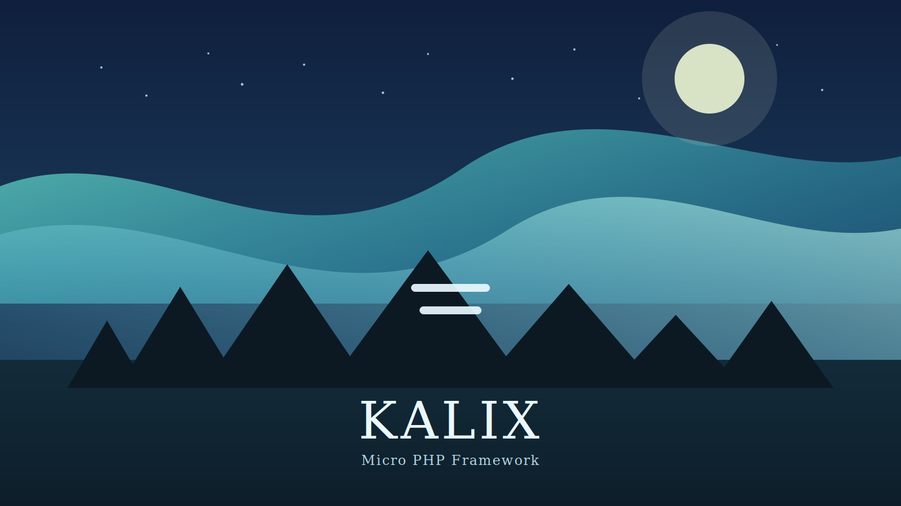

# Kalix



Kalix is a strict-typed, dependency-free PHP micro framework by Kalei.

It is designed to be minimal, fast, and easy to read.

## Highlights

- No Composer dependencies.
- Strict typing (`declare(strict_types=1);`).
- Localized routing by default (`/@lang/...`).
- Lightweight controller + view rendering.
- Built-in mysqli ORM base with mapper generation.

## Requirements

- PHP 8.2+
- mysqli extension enabled
- MySQL or MariaDB (for ORM/mappers)

## Quick Start

From project root:

```bash
php -S 127.0.0.1:8080 -t .
```

Open:

- `http://127.0.0.1:8080/en`
- `http://127.0.0.1:8080/it`

## Bootstrap

Kalix boots with a one-liner in [`index.php`](/Users/administrator/www/kalei.com/index.php):

```php
(require __DIR__ . '/Kalix/bootstrap.php')->run();
```

## Directory Layout

```text
kalei.com/
  Kalix/
    bootstrap.php
    Kalix.php
    Router.php
    Controller.php
    Db.php
    Mapper.php
  TOOLS/
    MakeMappers.php
  app/
    controllers/
    routes/
    views/
    locale/
    mappers/
    models/
    config/
  PRIVATE/
    secrets.php
  public/
    img/
```

## Routing and Localization

Routes live in `app/routes/*.php`.

Default patterns in `app/routes/routes.php` include:

- `'/@lang' => 'controllers/homepage->index'`
- `'/@lang/@controller/@action' => 'controllers/@controller->@action'`
- `'/@lang/@controller/@action/@param1/@param2' => 'controllers/@controller->@action'`

Language behavior:

- Localized URL (`/@lang/...`) sets the active language.
- If URL is not localized but matches a route, Kalix redirects to localized URL.
- Language preference order:
1. URL language
2. `lang` cookie
3. `Accept-Language` header
4. fallback `en` (or first available locale)

## Controllers and Views

Controllers extend `controllers\Controller` (which extends `Kalix\Controller`).

From an action:

```php
$this->render([
    'name' => 'Paolo',
]);
```

View naming:

- `controller` + `_` + `action` + `.php`
- Example: `homepage_index.php`

View rendering rules:

- `{{name}}` prints escaped value.
- `$name` is available as raw variable.
- Locale tokens are available in `$intl`.
- `|token_label|` is replaced with escaped locale token.

## ORM and DB Config

Kalix ORM uses a shared mysqli connection per database.

DB config is loaded from:

- `app/config/database.php`

If host/user/pass/name/port/socket are missing or empty, Kalix fills them from:

- `PRIVATE/secrets.php` constants:
  `DB_HOST`, `DB_USER`, `DB_PASS`, `DB_NAME`, `DB_PORT`, `DB_SOCK`, optional `DB_CHARSET`.

## Mapper Generator

Generate mappers/models (schema-first workflow):

```bash
php TOOLS/MakeMappers.php --app="$(pwd)/app" --db=default
```

What `MakeMappers.php` does now:

- Runs `TOOLS/myDump.php` first.
- Expects `schema.json` and `schema.xlsx` to be generated (default directory: `app/database/`).
- Uses `schema.json` as the source of truth to generate/rebuild `app/mappers/*`.
- Creates missing `app/models/*` files.

Optional schema directory override:

```bash
php TOOLS/MakeMappers.php --schema-dir="$(pwd)"
```

Interactive mode (passed through to `myDump`):

```bash
./TOOLS/MakeMappers.php -i --db=default
```

SSH mode (passed through to `myDump`):

```bash
./TOOLS/MakeMappers.php --ssh --db=default
```

Interactive SSH mode:

```bash
./TOOLS/MakeMappers.php -i --ssh --db=default
```

Suggested cycle:

1. Edit `schema.json` or `schema.xlsx`.
2. Apply schema changes to DB with `myDump`.
3. Run `MakeMappers.php` to refresh `schema.*` from DB and rebuild mappers.

## Notes

- `app/mappers/*` are generated files and can be overwritten.
- Put project-specific logic in `app/models/*` and controllers.
- Keep `PRIVATE/` out of git (already ignored in `.gitignore`).

---

Original Kalix artwork is included at `public/img/kalix-aurora.svg`.
